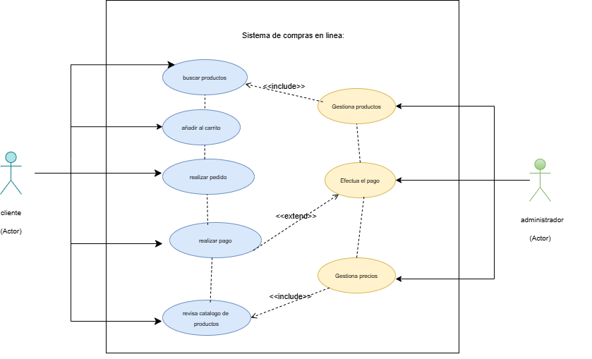

# git-sistema-de-compras-online

# Actores

|  Actor | XXX (Nombre del Actor) |
|---|---|
| Descripción  | _Cliente_  |
| Características  | _Le gusta la ropa adidaS_ |
| Relaciones | _Prefiere comprar ropa de deporte para jugar con otros compañeros_  |
| Referencias | _Ingresa a la tienda, revisa, añade y compra_ |   
|  Notas |  _Suele comprar cuando es fin de semana_ |
| Autor  | _Qcliente_ |
|Fecha | _01-11-2024_ |

|  Atributo |||
|---|---|---|
| _Nombre_  | _Descripción_  | _Tipo_ |
| | |

|  Actor | XXX (Nombre del Actor) |
|---|---|
| Descripción  | _administrador_  |
| Características  | _le encanta el comercio_ |
| Relaciones | _gestiona los analicis y lso debate con sus compañeros._  |
| Referencias | _ingreso,actualizacion,y delete_ |   
|  Notas |  _Le gusta anexar ideas nuevas a la tienda_ |
| Autor  | _Administrador_ |
|Fecha | _Fecha de la especificación_ |

|  Atributo |||
|---|---|---|
| _Nombre_  | _Descripción_  | _Tipo_ |
| | |

 ___

# Casos de Uso

|  Caso de Uso	CU | XXX  |
  |---|---|
  | Fuentes  | __  |
  | Actor  |  _cliente_ |
  | Descripción | _Descripción del caso de uso_  |
  | Flujo básico | _Descripción paso a paso de la ejecución. (1->2->3.)_ |
  | Pre-condiciones | _Que debe ocurrir con anterioridad_  |  
  | Post-condiciones  | _Que debe ocurrir con posterioridad_  |  
  |  Requerimientos | _Que debe de exister para que el caso de uso se ejecute. Ej: Tarjeta de crédito_  |
  |  Notas |  _Notas adicionales_ |
  | Autor  | _Quien desarrolla la especificación del actor_ |
  |Fecha | _Fecha de la especificación_ |

  Caso de Uso	CU | XXX  |
  |---|---|
  | Fuentes  | _administrador_  |
  | Actor  |  _Actores que participan en el caso de uso_ |
  | Descripción | _Descripción del caso de uso_  |
  | Flujo básico | _Descripción paso a paso de la ejecución. (1->2->3.)_ |
  | Pre-condiciones | _Que debe ocurrir con anterioridad_  |  
  | Post-condiciones  | _Que debe ocurrir con posterioridad_  |  
  |  Requerimientos | _Que debe de exister para que el caso de uso se ejecute. Ej: Tarjeta de crédito_  |
  |  Notas |  _Notas adicionales_ |
  | Autor  | _Quien desarrolla la especificación del actor_ |
  |Fecha | _Fecha de la especificación_ |

  

  __Author: Hadccode__